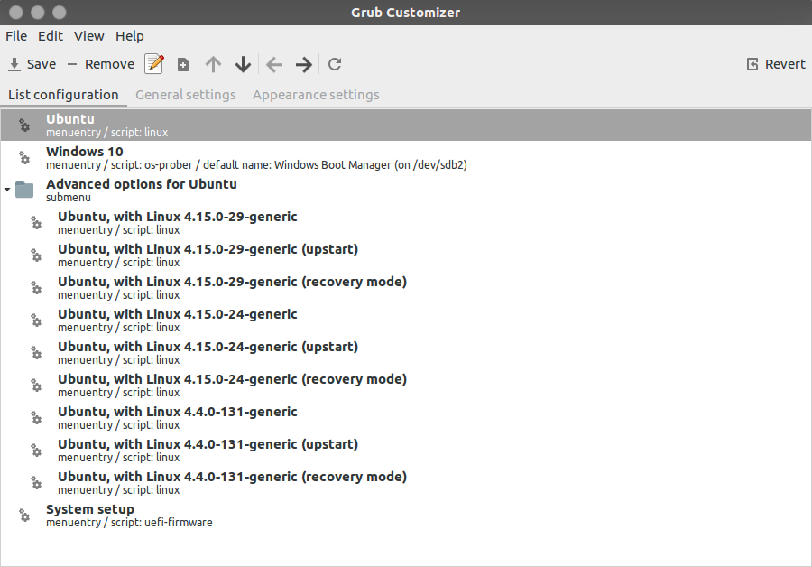

# Customization
## Summary
- [Grub Customization](#grub-customization)
## Content
### Grub Customization
#### 1. Grub Customizer
- Install grub customizer
  ```
  sudo add-apt-repository ppa:danielrichter2007/grub-customizer
  sudo apt-get update
  sudo apt-get install grub-customizer
  ```
- Enjoy the wonderful GUI!!!


#### 4. Grub Theme
- You can download the theme from this website: https://www.gnome-look.org/browse/cat/109/.
- Usually after your extract the package, you can run the install script inside with root access to install the theme.
- **Important!!!** Make sure all the pictures and .txt files are inside `/boot/grub/themes/<name-of-the-theme>/`. 
#### 3. Command line
- At boot grub will try to read `/boot/grub/grub.cfg`, but don't try to directly change this file. It is automatically generated through command `sudo update-grub`. The generation mainly base on `/etc/default/grub` and files in `/etc/grub.d/`
- **edit `/etc/default/grub`:** This is file is generally easy to edit, but the functionality of grub that you can change is very limited.
  
  Open  the file with your favorite editor under root access.
  

  - **Choose the Default OS**: Change the **GRUB_DEFAULT**= line. By default, **GRUB_DEFAULT**=0 uses the first entry as the default — change the number to 1 to use the second entry, 2 to use the third entry, or so on. You could also use **GRUB_DEFAULT**=saved and GRUB would automatically boot the last operating system you chose each time you boot. You can also specify a label in quotes. For example, if you had an operating system named "Windows 10 (loader)" in your OS list, you could use **GRUB_DEFAULT**=”Windows 10 (loader)”.

    Save a Default Operating System: If you choose **GRUB_DEFAULT**=saved, you also need to add a **GRUB_SAVEDEFAULT**=true line — otherwise it won’t work.
  
  - **Control GRUB’s Menu Timeout**: If GRUB isn’t automatically hidden, you’ll see the menu each time your computer boots. GRUB will automatically bot the default operating system after a period of time, usually ten seconds. During that time, you can choose another OS or leave it be to automatically boot. To change the timeout period, edit the **GRUB_TIMEOUT**=10 line and enter any number of seconds you like. (Remember, this is only used if GRUB isn’t hidden.) To prevent GRUB from booting automatically and always wait for you to choose an OS, change the line to **GRUB_TIMEOUT**=-1.
  - **Choose a Background Image**: The **GRUB_BACKGROUND** line controls whether a background image is used — by default, GRUB uses a white-on-black monochrome look. You can add a line like **GRUB_BACKGROUND**=”/home/user/Pictures/background.png” to specify an image file GRUB will use.
 
  Remember to run `sudo update-grub` for your changes to take effect.
  
  *Reference: https://www.howtogeek.com/196655/how-to-configure-the-grub2-boot-loaders-settings/*
  


